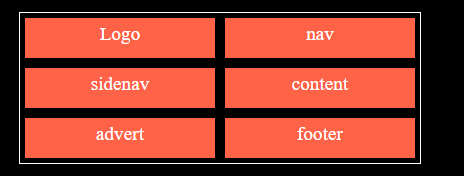
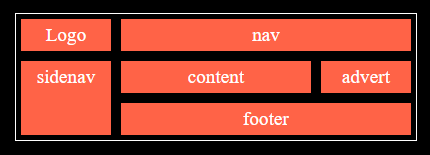
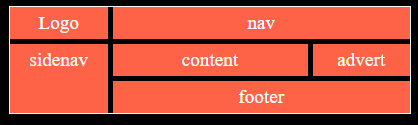
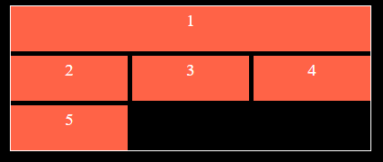
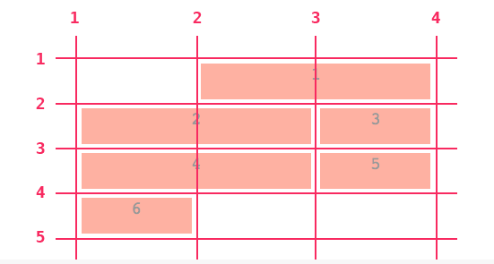
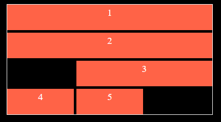
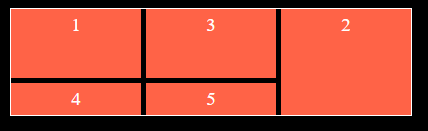

#CSS GRID LAYOUT

## GRID CONTAINER

Tag que irá envolver os elementos para serem GRID; \*\* O Filho do filho não será GRID

display: grid; Tem o comportamento inicial similar ao display BLOCK;

Quando for usar o grid, tenho que me ater as propriedades templates, ou seja, ele sempre vai começar com grid e logo após virá o template:

Exemplo:

- grid-templates-columns

--

O display sera aplicado no container, para afetar os filhos:

```html
<section class="container">
  <div class="Item1">1</div>
  <div class="Item1">2</div>
  <div class="Item1">3</div>
  <div class="Item1">4</div>
</section>
```

Unidade FR foi introduzida no grid layout:

Quer dizer que é 1 fração , ou seja posso ter 3 elementos e quero que eles sejam iguais em tamanho, logo coloco 1fr 1fr 1fr. Posso ir alterando as frações de acordo com o planejado.

Exemplo:

```html
<section class="grid-fr">
  <div class="Item1">1</div>
  <div class="Item1">2</div>
  <div class="Item1">3</div>
  <div class="Item1">4</div>
</section>
```

```css
.grid-fr {
  display: grid;
  grid-template-columns: 1fr 1fr 1fr;
}
```

Resultado

<section class="grid-fr" style="display:grid; grid-template-columns: 1fr 1fr 1fr 1fr; border: 1px solid white; max-width:400px; margin:0 auto;">
    <div class="item" style="background-color:tomato; text-align: center; font-size: 1.1em; margin: 5px; border: 1px solid black;">1</div>
    <div class="item" style="background-color:tomato; text-align: center; font-size: 1.1em; margin: 5px; border: 1px solid black;">2</div>
    <div class="item" style="background-color:tomato; text-align: center; font-size: 1.1em; margin: 5px; border: 1px solid black;">3</div>
    <div class="item" style="background-color:tomato; text-align: center; font-size: 1.1em; margin: 5px; border: 1px solid black;">4</div>
</section>
--

## Propriedades:

grid-template-columns: Define o número de colunas dentro do grid.

Como usar:

No HTML eu defino meu container ou classe que desejo aplicar o grid:

```html
<section class="grid-fr">
  <div class="Item1">1</div>
  <div class="Item1">2</div>
  <div class="Item1">3</div>
  <div class="Item1">4</div>
</section>
```

```css
.grid-fr {
  display: grid;
  grid-template-columns: 1fr 1fr 1fr;
}
```

No CSS eu defino o display grid + a propriedade em questão:

Exemplos:

- Usando px:

<section class="grid-fr" style="display:grid; grid-template-columns: 100px 100px 100px 100px; border: 1px solid white; max-width:400px; margin:0 auto;">
    <div class="item" style="background-color:tomato; text-align: center; font-size: 1.1em; margin: 5px; border: 1px solid black;">1</div>
    <div class="item" style="background-color:tomato; text-align: center; font-size: 1.1em; margin: 5px; border: 1px solid black;">2</div>
    <div class="item" style="background-color:tomato; text-align: center; font-size: 1.1em; margin: 5px; border: 1px solid black;">3</div>
    <div class="item" style="background-color:tomato; text-align: center; font-size: 1.1em; margin: 5px; border: 1px solid black;">4</div>
</section>

- Usando fr:

<section class="grid-fr" style="display:grid; grid-template-columns: 1fr 1fr 1fr 1fr; border: 1px solid white; max-width:400px; margin:0 auto;">
    <div class="item" style="background-color:tomato; text-align: center; font-size: 1.1em; margin: 5px; border: 1px solid black;">1</div>
    <div class="item" style="background-color:tomato; text-align: center; font-size: 1.1em; margin: 5px; border: 1px solid black;">2</div>
    <div class="item" style="background-color:tomato; text-align: center; font-size: 1.1em; margin: 5px; border: 1px solid black;">3</div>
    <div class="item" style="background-color:tomato; text-align: center; font-size: 1.1em; margin: 5px; border: 1px solid black;">4</div>
</section>

---

Podemos economizar tempo usando a função repeat(); Funciona assim: repeat("Número de colunas","Tamanho")

<section class="grid-fr" style="display:grid; grid-template-columns: repeat(4,1fr); border: 1px solid white; max-width:400px; margin:0 auto;">
    <div class="item" style="background-color:tomato; text-align: center; font-size: 1.1em; margin: 5px; border: 1px solid black;">1</div>
    <div class="item" style="background-color:tomato; text-align: center; font-size: 1.1em; margin: 5px; border: 1px solid black;">2</div>
    <div class="item" style="background-color:tomato; text-align: center; font-size: 1.1em; margin: 5px; border: 1px solid black;">3</div>
    <div class="item" style="background-color:tomato; text-align: center; font-size: 1.1em; margin: 5px; border: 1px solid black;">4</div>
</section>

- Usando px como unidade de medida:

<section class="grid-fr" style="display:grid; grid-template-columns:repeat(4,100px); border: 1px solid white; max-width:400px; margin:0 auto;">
    <div class="item" style="background-color:tomato; text-align: center; font-size: 1.1em; margin: 5px; border: 1px solid black;">1</div>
    <div class="item" style="background-color:tomato; text-align: center; font-size: 1.1em; margin: 5px; border: 1px solid black;">2</div>
    <div class="item" style="background-color:tomato; text-align: center; font-size: 1.1em; margin: 5px; border: 1px solid black;">3</div>
    <div class="item" style="background-color:tomato; text-align: center; font-size: 1.1em; margin: 5px; border: 1px solid black;">4</div>
</section>

**Tenho sempre que me ater ao tamanho do meu container, para não estourar ele.**

Segue exemplo de um container estourado, isto porque no elemento pai, foi definido um max-width de 400px. Observe abaixo:

<section class="grid-fr" style="display:grid; grid-template-columns:repeat(4,150px); border: 1px solid white; max-width:400px; margin:0 auto;">
    <div class="item" style="background-color:tomato; text-align: center; font-size: 1.1em; margin: 5px; border: 1px solid black;">1</div>
    <div class="item" style="background-color:tomato; text-align: center; font-size: 1.1em; margin: 5px; border: 1px solid black;">2</div>
    <div class="item" style="background-color:tomato; text-align: center; font-size: 1.1em; margin: 5px; border: 1px solid black;">3</div>
    <div class="item" style="background-color:tomato; text-align: center; font-size: 1.1em; margin: 5px; border: 1px solid black;">4</div>
</section>

---

Trabalhando com minmax(), ou seja ele tera o mínimo como base e o máximo que ele poderá atingir;

<section class="grid-fr" style="display:grid; grid-template-columns:repeat(4,minmax(100px,1fr)); border: 1px solid white; max-width:400px; margin:0 auto;">
    <div class="item" style="background-color:tomato; text-align: center; font-size: 1.1em; margin: 5px; border: 1px solid black;">1</div>
    <div class="item" style="background-color:tomato; text-align: center; font-size: 1.1em; margin: 5px; border: 1px solid black;">2</div>
    <div class="item" style="background-color:tomato; text-align: center; font-size: 1.1em; margin: 5px; border: 1px solid black;">3</div>
    <div class="item" style="background-color:tomato; text-align: center; font-size: 1.1em; margin: 5px; border: 1px solid black;">4</div>
</section>

---

Começando a entrar na responsividade com auto-fill e auto-fit:

auto-fill, irá auto organizar o item dentro do container de acordo com o tamanho solicitado, segue exemplo:

<section class="grid-fr" style="display:grid; grid-template-columns:repeat(auto-fill,100px); border: 1px solid white; max-width:400px; margin:0 auto;">
    <div class="item" style="background-color:tomato; text-align: center; font-size: 1.1em; margin: 5px; border: 1px solid black;">1</div>
    <div class="item" style="background-color:tomato; text-align: center; font-size: 1.1em; margin: 5px; border: 1px solid black;">2</div>
    <div class="item" style="background-color:tomato; text-align: center; font-size: 1.1em; margin: 5px; border: 1px solid black;">3</div>
    <div class="item" style="background-color:tomato; text-align: center; font-size: 1.1em; margin: 5px; border: 1px solid black;">4</div>
</section>

auto-fit, dará sempre prioridade para as colunas, mesmo que sobre espaço ele irá criar mais colunas e não alocar o elemento conforme o auto-fill. Segue exemplo:

<section class="grid-fr" style="display:grid; grid-template-columns:repeat(auto-fit,80px); border: 1px solid white; max-width:400px; margin:0 auto;">
    <div class="item" style="background-color:tomato; text-align: center; font-size: 1.1em; margin: 5px; border: 1px solid black;">1</div>
    <div class="item" style="background-color:tomato; text-align: center; font-size: 1.1em; margin: 5px; border: 1px solid black;">2</div>
    <div class="item" style="background-color:tomato; text-align: center; font-size: 1.1em; margin: 5px; border: 1px solid black;">3</div>
    <div class="item" style="background-color:tomato; text-align: center; font-size: 1.1em; margin: 5px; border: 1px solid black;">4</div>
</section>

Neste exemplo ele deixou um espaço em branco, onde caso, se tive espaço e entrar mais um elemento div, ele alocará o mesmo.

## grid-template-rows

Utiliza as mesmas propriedades do columns, vamos para os exemplos:

Neste primeiro exemplo iremos utilizar apenas 2 colunas com 2 linhas e iremos alterar os tamanhos das linhas, sendo a primeira com 100px e segunda com 200px;

<section class="grid-fr" style="display:grid; grid-template-columns:1fr 1fr; grid-template-rows:100px 200px; border: 1px solid white; max-width:400px; margin:0 auto;">
    <div class="item" style="background-color:tomato; text-align: center; font-size: 1.1em; margin: 5px; border: 1px solid black;">1</div>
    <div class="item" style="background-color:tomato; text-align: center; font-size: 1.1em; margin: 5px; border: 1px solid black;">2</div>
    <div class="item" style="background-color:tomato; text-align: center; font-size: 1.1em; margin: 5px; border: 1px solid black;">3</div>
    <div class="item" style="background-color:tomato; text-align: center; font-size: 1.1em; margin: 5px; border: 1px solid black;">4</div>
</section>

Neste exemplo eu defini um grid columns de 2 colunas e defini um rows com 4 linhas de 100px, porém como o conteúdo já se ajustou em 2 linhas, ele deixara o espaço vazio para o restante que entrar. Note que usamos a propriedade repeat().

<section class="grid-fr" style="display:grid; grid-template-columns:repeat(auto-fit,200px); grid-template-rows:repeat(4,100px); border: 1px solid white; max-width:400px; margin:0 auto;">
    <div class="item" style="background-color:tomato; text-align: center; font-size: 1.1em; margin: 5px; border: 1px solid black;">1</div>
    <div class="item" style="background-color:tomato; text-align: center; font-size: 1.1em; margin: 5px; border: 1px solid black;">2</div>
    <div class="item" style="background-color:tomato; text-align: center; font-size: 1.1em; margin: 5px; border: 1px solid black;">3</div>
    <div class="item" style="background-color:tomato; text-align: center; font-size: 1.1em; margin: 5px; border: 1px solid black;">4</div>
</section>

Neste exemplo passamos o repeat() com auti-fill e tamanho de 300px e um minmax de 100px e 1fr

<section class="grid-fr" style="display:grid; grid-template-columns:repeat(auto-fill,250px); grid-template-rows:repeat(4,minmax(100px,1fr)); border: 1px solid white; max-width:400px; margin:0 auto;">
    <div class="item" style="background-color:tomato; text-align: center; font-size: 1.1em; margin: 5px; border: 1px solid black;">1</div>
    <div class="item" style="background-color:tomato; text-align: center; font-size: 1.1em; margin: 5px; border: 1px solid black;">2</div>
    <div class="item" style="background-color:tomato; text-align: center; font-size: 1.1em; margin: 5px; border: 1px solid black;">3</div>
    <div class="item" style="background-color:tomato; text-align: center; font-size: 1.1em; margin: 5px; border: 1px solid black;">4</div>
</section>

## Grid template areas

Define as áreas do site.

Como usar:

```html
<section class="container">
  <div class="item logo">Logo</div>
  <div class="item nav">nav</div>
  <div class="item sidenav">sidenav</div>
  <div class="item content">content</div>
  <div class="item advert">advert</div>
  <div class="item footer">footer</div>
</section>
```

```css
body {
  background-color: black;
  color: white;
}
.container {
  display: grid;
  grid-template-areas:
    "logo nav nav"
    "sidenav content advert"
    "sidenav footer footer";
  border: 1px solid white;
  max-width: 400px;
  margin: 0 auto;
  margin-top: 100px;
}
.item {
  background-color: tomato;
  margin: 5px;
  padding: 5px;
  font-size: 1.2em;
  text-align: center;
}

.logo {
  grid-area: logo;
}

.nav {
  grid-area: nav;
}
.sidenav {
  grid-area: sidenav;
}
.content {
  grid-area: content;
}
.advert {
  grid-area: advert;
}
.footer {
  grid-area: footer;
}
```

Vamos aplicar este layor na prática:


## Grid template

É a junção dos 3 elementos que vimos anteriormente, mais conhecido como shortcut, veremos exemplos:

```html
<section class="container">
  <div class="item logo">Logo</div>
  <div class="item nav">nav</div>
  <div class="item sidenav">sidenav</div>
  <div class="item content">content</div>
  <div class="item advert">advert</div>
  <div class="item footer">footer</div>
</section>
```

Forma 1 de se aplicar o css:

```css
display: grid;
grid-template: 50px 50px 50px / repeat(2, 1fr); /* Primeiro as linhas, depois colunas */
```

resultado:

Note que usamos apenas o template sem apontar os indicativos das classes.



forma 2 de se aplicar o css:

```css
.container {
  display: grid;
  grid-template:
    "logo nav nav"
    "sidenav content advert"
    "sidenav footer footer"
    / 1fr 2fr 1fr;
  border: 1px solid white;
  max-width: 400px;
  margin: 0 auto;
  margin-top: 100px;
}
.item {
  background-color: tomato;
  margin: 5px;
  padding: 5px;
  font-size: 1.2em;
  text-align: center;
}

.logo {
  grid-area: logo;
}

.nav {
  grid-area: nav;
}
.sidenav {
  grid-area: sidenav;
}
.content {
  grid-area: content;
}
.advert {
  grid-area: advert;
}
.footer {
  grid-area: footer;
}
```

Resultado:



### Grid GAP

gap: define um espaçamento entre os elementos do grid;

OBS: A margem influencia diretamente no item;

Temos as variações para grid-gap-columns e grid-gap-rows, respectivamente, um afeta as colunas e outro afeta as linhas;

Exemplo de código:

HTML:

```html
<section class="container">
  <div class="item logo">Logo</div>
  <div class="item nav">nav</div>
  <div class="item sidenav">sidenav</div>
  <div class="item content">content</div>
  <div class="item advert">advert</div>
  <div class="item footer">footer</div>
</section>
```

CSS:

```css
.container {
  display: grid;
  grid-template:
    "logo nav nav"
    "sidenav content advert"
    "sidenav footer footer"
    / 1fr 2fr 1fr;
  border: 1px solid white;
  max-width: 400px;
  margin: 0 auto;
  margin-top: 100px;
  gap: 5px;
}
.item {
  background-color: tomato;
  padding: 5px;
  font-size: 1.2em;
  text-align: center;
}

.logo {
  grid-area: logo;
}

.nav {
  grid-area: nav;
}
.sidenav {
  grid-area: sidenav;
}
.content {
  grid-area: content;
}
.advert {
  grid-area: advert;
}
.footer {
  grid-area: footer;
}
```

Resultado:



O gap, também pode ser usado como shorthand para as variações:

gap: 20px 20px; afetando primeiro a linha e depois a coluna.

## Grid Auto Columns

Define o tamaho das columas implicitas; **Columas implicitas são geradas automaticamentes, caso ocorra esta necessidade**.

## Grid Auto Rows

Define a linha do grid implicita. **Linhas implicitas são geradas automaticamente, caso ocorra esta necessidade**.

## Grid Auto Flow

Define o fluxo padrão da criação de novos itens;

Por padrão os itens novos criados, são gerados em uma nova linha, mas podemos alterar a maneira como isto se comporta com o grid-auto-flow;

Valores:

grid-auto-flow:column; Define o valor para colunas

grid-auto-flow:dense; Define o valor para se ajustar de acordo com os espaços disponíveis. Utilizado em casos que não importa a ordem.

# Grid Item

## Grid Column

Podemos inserir um valor para item da coluna diretamente, definir sua posição, alterar comportamentos e etc, tudo isto usando o grid-column

Vamos ver abaixo alguns exemplos:

- Definindo a posição de um item:

HTML:

```html
<section class="container">
  <div class="item item1">1</div>
  <div class="item item2">2</div>
  <div class="item item3">3</div>
  <div class="item item4">4</div>
  <div class="item item5">5</div>
</section>
```

```css
body {
  background-color: black;
  color: white;
}
.container {
  display: grid;
  grid-template-columns: 1fr 1fr 1fr;
  /*   grid-template:"logo nav nav"
    "sidenav content advert"
    "sidenav footer footer"
    / 1fr 2fr 1fr; */
  border: 1px solid white;
  max-width: 400px;
  margin: 0 auto;
  margin-top: 100px;
  /*   gap:5px; */
  grid-column-gap: 5px;
  grid-row-gap: 5px;
  grid-auto-rows: 50px;
}
.item {
  background-color: tomato;
  padding: 5px;
  /*   margin:5px; */
  font-size: 1.2em;
  text-align: center;
}

.item1 {
  grid-column: 1/4;
}
```

Exemplo 1: Este usei o grid-colum, no item 1, onde falo que ele irá pegar da coluna 1 e vai até o final dela:



Se reparar no código, vai estar assim:

```css
.item1 {
  grid-column: 1/4;
}
```

Isto se da pelo fato de tratarmos as columas também com linhas iniciais e finais, a imagem abaixo irá ajudar na representação, mas para sem mais fácil de lembrar, sempre lembre que **Se você declarou um grid com 5 colunas, as linhas da colunas serão 6, sempre some 1 linha de coluna no total de número de colunas**.



Neste próximo exemplo, usei o **span**, uma propriedade que define o tamanho que o item ocupará, como exemplo informei que o item2, ocupara as 3 colunas. Consigo também usar a **/** para dizer onde o item começará, em qual linha e especificar o **span** dele.



## grid-row

Define quais linhas serão ocupadas pelo grid item.

Atenção aqui, pois esse linha é referente a row. Porém as chamadas grid lines que por tradução também significam linhas do grid, são diferentes. Uma row (linha), possui sempre 2 grid lines (linhas do grid), uma no início dela e uma no final dela.

Segue abaixo alguns exemplos de uso:

HTML:

```html
<section class="container">
  <div class="item item1">1</div>
  <div class="item item2">2</div>
  <div class="item item3">3</div>
  <div class="item item4">4</div>
  <div class="item item5">5</div>
</section>
```

CSS:

```css
body {
  background-color: black;
  color: white;
}
.container {
  display: grid;
  grid-template-columns: [col1]1fr [col2]1fr [col3]1fr;
  grid-template-rows: [row1]1fr [row2]1fr [row3]1fr;
  /*   grid-template:"logo nav nav"
    "sidenav content advert"
    "sidenav footer footer"
    / 1fr 2fr 1fr; */
  border: 1px solid white;
  max-width: 400px;
  margin: 0 auto;
  margin-top: 100px;
  /*   gap:5px; */
  grid-column-gap: 5px;
  grid-row-gap: 5px;
  grid-auto-rows: 50px;
  grid-auto-columns: 50px;
}
.item {
  background-color: tomato;
  padding: 5px;
  /*   margin:5px; */
  font-size: 1.2em;
  text-align: center;
}

.container .item1 {
  grid-row: 1/3;
}

.container .item2 {
  grid-row: span 3;
}

.container .item3 {
  grid-row: row1/row3;
}
```

Neste exemplo apliquei o grid-row no item 1 ao item 3;

No item 1, falei que ele vai pegar da grid-row 1 até a 3;

No item 2, falei que ele deverá ocupar 3 "casas" com o span;

No item 3, usei os apelidos, que denominei no grid-template-row, para determinar onde uma linha começa e onde acaba.

Segue exemplo:



Note que neste exemplo temos apenas 3 linhas;

Agora iremos para a construção do site, Wildbeast!!
